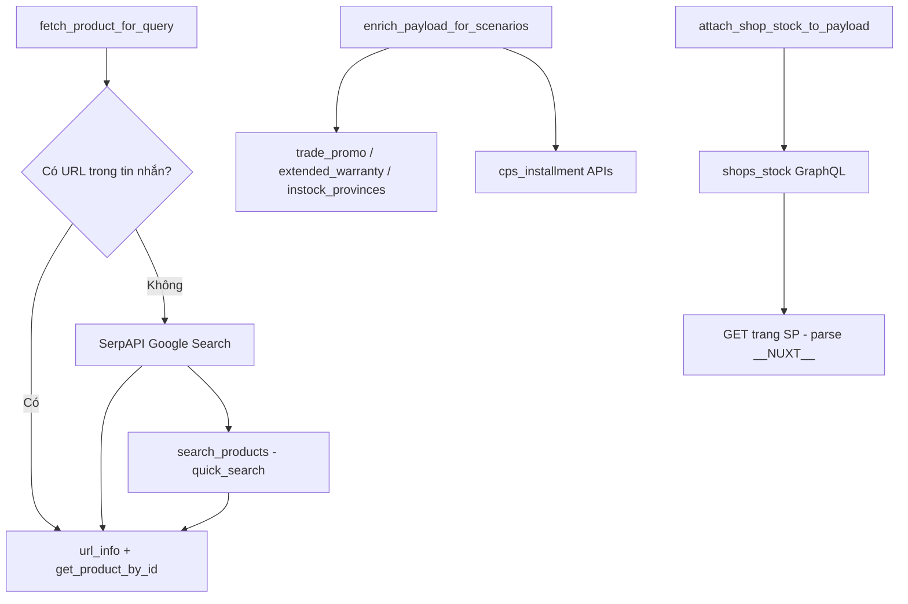

# Tài liệu API — `cps_api.py`

Module client gọi API CellphoneS (GraphQL, REST, SerpAPI) để resolve URL → `product_id` → chi tiết sản phẩm, tồn cửa hàng, trade-in, bảo hành mở rộng và trả góp.

**File nguồn:** [`cps_api.py`](cps_api.py)  
**Phụ thuộc:** [`config.py`](config.py), [`scraper.py`](scraper.py), [`cps_installment.py`](cps_installment.py)

---

## Mục lục

1. [Tổng quan luồng](#1-tổng-quan-luồng)
2. [Biến môi trường](#2-biến-môi-trường)
3. [GraphQL CellphoneS](#3-graphql-cellphones)
4. [SerpAPI](#4-serpapi)
5. [Tìm kiếm sản phẩm (scraper)](#5-tìm-kiếm-sản-phẩm-scraper)
6. [Scrape trang web](#6-scrape-trang-web)
7. [API trả góp (cps_installment)](#7-api-trả-góp-cps_installment)
8. [Hàm public & mapping API](#8-hàm-public--mapping-api)
9. [Enrich theo kịch bản câu hỏi](#9-enrich-theo-kịch-bản-câu-hỏi)
10. [Thống kê gọi API](#10-thống-kê-gọi-api)

---

## 1. Tổng quan luồng



**Luồng resolve sản phẩm (`fetch_product_for_query`):**

1. Trích URL `cellphones.com.vn/*.html` từ tin nhắn hoặc session fallback.
2. Nếu có URL → `fetch_product_from_url()` (GraphQL `url_info` + `product`).
3. Nếu không có URL:
   - **Layer 1:** SerpAPI (`site:cellphones.com.vn {keywords}`).
   - **Layer 2:** `search_products()` (GraphQL `quick_search`, fallback scrape catalogsearch).
4. Với mỗi URL tìm được → `fetch_product_from_url()`.

---

## 2. Biến môi trường

| Biến | Mặc định | Mô tả |
|------|----------|--------|
| `CPS_GRAPHQL_URL_ENDPOINT` | `https://api.cellphones.com.vn/graphql-url/graphql/query` | Resolve URL → `product_id` / `category_id` |
| `CPS_GRAPHQL_V2_ENDPOINT` | `https://api.cellphones.com.vn/v2/graphql/query` | Chi tiết SP, danh sách theo category, tồn tỉnh |
| `CPS_GRAPHQL_DASHBOARD_ENDPOINT` | `https://api.cellphones.com.vn/graphql-dashboard/graphql/query` | Tồn cửa hàng, trade-in, bảo hành mở rộng |
| `CPS_GRAPHQL_SEARCH_ENDPOINT` | `https://api.cellphones.com.vn/graphql-search/v2/graphql/query` | Tìm kiếm `quick_search` (qua `scraper.py`) |
| `CPS_WEB_BASE_URL` | `https://cellphones.com.vn` | Base URL trang web |
| `CPS_PROVINCE_ID` | `30` | Tỉnh mặc định (30 = HCM, 24 = HN, 27 = ĐN) |
| `SERPAPI_ENABLED` | `1` | Bật/tắt SerpAPI |
| `SERPAPI_API_KEY` | — | API key SerpAPI |
| `SERPAPI_ENDPOINT` | `https://serpapi.com/search.json` | Endpoint SerpAPI |
| `SERPAPI_FALLBACK_TO_CPS_SEARCH` | `0` | `1` = fallback sang CPS search khi Serp lỗi/không kết quả |
| `CPS_API_BASE_URL` | `https://api.cellphones.com.vn` | Base REST payment (trả góp) |
| `CPS_PAYMENT_VER` | `v3` | Version payment API |
| `CPS_SSO_GUEST_TOKEN_URL` | `https://api.smember.com.vn/sso/v1/auth/guest-token` | Guest token cho trả góp |

---

## 3. GraphQL CellphoneS

Tất cả GraphQL trong `cps_api.py` gọi qua helper `_graphql()`:

- **Method:** `POST`
- **Body:** `{ "query": "...", "variables": { ... } }`
- **Header:** `Content-Type: application/json`
- **Timeout:** 30s

### 3.1 GraphQL URL — `url_info`

| | |
|---|---|
| **Endpoint** | `CPS_GRAPHQL_URL_ENDPOINT` |
| **Hàm** | `url_info(request_path)` |
| **Query** | `URL_INFO` |

**Variables:**

```json
{ "path": "/dien-thoai-iphone-16-pro-max.html" }
```

**Response field:** `data.url_info` → `{ id, category_id, product_id }`

---

### 3.2 GraphQL V2 — chi tiết sản phẩm

| | |
|---|---|
| **Endpoint** | `CPS_GRAPHQL_V2_ENDPOINT` |
| **Hàm** | `get_product_by_id(product_id, province_id?)` |
| **Query** | `getProductDataDetail` |

**Variables:**

```json
{ "id": "12345", "provinceId": 30 }
```

**Response field:** `data.product` → `{ general, filterable, specification }`

**Fallback:** Nếu `filterable` thiếu dữ liệu (giá member/KM) và endpoint khác production → gọi lại `CPS_GRAPHQL_V2_PRODUCTION` (`https://api.cellphones.com.vn/v2/graphql/query`).

**Dữ liệu lấy về (chính):**

- `general`: tên, SKU, manufacturer, `url_path`, categories, `up_sell`, …
- `filterable`: giá, `prices` (S-Member, HSSV, …), `promotion_pack`, stock, `warranty_information`, …
- `specification`: `basic`, `full_by_group`

---

### 3.3 GraphQL V2 — sản phẩm theo danh mục

| | |
|---|---|
| **Endpoint** | `CPS_GRAPHQL_V2_ENDPOINT` |
| **Hàm** | `get_products_by_category_id(category_id, province_id?, size?, page?)` |
| **Query** | `GetProductsByCateId` |

**Variables:**

```json
{
  "cateId": "123",
  "provinceId": 30,
  "size": 12,
  "page": 1
}
```

**Filter:** `stock.from: 1`, `company_stock_id: [46, 152, 4920, 4164]`, sort `view: desc`.

**Dùng khi:** URL resolve ra `category_id` thay vì `product_id` (trang danh mục).

---

### 3.4 GraphQL V2 — tồn tỉnh khác

| | |
|---|---|
| **Endpoint** | `CPS_GRAPHQL_V2_ENDPOINT` |
| **Hàm** | `fetch_instock_other_provinces(product_id, province_id?)` |
| **Query** | `InstockProvince` |

**Variables:**

```json
{ "productId": 12345, "companyId": 12869 }
```

**Response field:** `data.instock_provinces` → `[{ id }]`  
**`company_id`:** map theo tỉnh — HCM `12869`, HN/ĐN `3759`.

---

### 3.5 GraphQL Dashboard — tồn cửa hàng

| | |
|---|---|
| **Endpoint** | `CPS_GRAPHQL_DASHBOARD_ENDPOINT` |
| **Hàm** | `get_shops_stock(product_id, province_id?)` |
| **Query** | `SHOP_STOCK` |

**Variables:**

```json
{ "productId": 12345, "provinceId": 30 }
```

**Response field:** `data.shops_stock` → danh sách quận + shops (`address`, `phone`, `near`, `google_link`, …).

**Fallback:** `fetch_shop_stock_from_product_page()` — GET trang SP, parse `window.__NUXT__` → `listShopStock`.

---

### 3.6 GraphQL Dashboard — trade-in

| | |
|---|---|
| **Endpoint** | `CPS_GRAPHQL_DASHBOARD_ENDPOINT` |
| **Hàm** | `fetch_trade_promo_for_product(detail, province_id?)` |
| **Query** | `tradePromo` |

**Variables:**

```json
{
  "productId": 12345,
  "categoryIds": ["123", "456"],
  "companyId": 12869
}
```

**Response field:** `data.trade_promo` → `{ product_id, promo_value, pmh }`

---

### 3.7 GraphQL Dashboard — bảo hành mở rộng

| | |
|---|---|
| **Endpoint** | `CPS_GRAPHQL_DASHBOARD_ENDPOINT` |
| **Hàm** | `fetch_extended_warranty_for_product(detail)` |
| **Query** | `warranty` (resolver: `extended_warranty`) |

**Variables:**

```json
{
  "productId": 12345,
  "categories": [123, 456],
  "productPrice": 29990000.0
}
```

**Response field:** `data.extended_warranty` → `{ warranty_url, warranty_packs[] }`

---

## 4. SerpAPI

| | |
|---|---|
| **Endpoint** | `SERPAPI_ENDPOINT` (mặc định `https://serpapi.com/search.json`) |
| **Method** | `GET` |
| **Hàm** | `fetch_product_for_query()` |
| **Timeout** | 20s |

**Query params:**

| Param | Giá trị |
|-------|---------|
| `engine` | `google` |
| `q` | `site:cellphones.com.vn {keywords}` |
| `api_key` | `SERPAPI_API_KEY` |
| `num` | `10` |

**Xử lý kết quả:** Lọc `organic_results[].link` khớp `cellphones.com.vn/*.html`, chấm điểm ưu tiên URL SKU (không phải danh mục/phụ kiện).

**Điều kiện bật:** `SERPAPI_ENABLED=1` và có `SERPAPI_API_KEY`.

---

## 5. Tìm kiếm sản phẩm (scraper)

Gọi gián tiếp từ `fetch_product_for_query()` qua `search_products()` trong [`scraper.py`](scraper.py).

### 5.1 GraphQL quick_search (ưu tiên)

| | |
|---|---|
| **Endpoint** | `CPS_GRAPHQL_SEARCH_ENDPOINT` |
| **Method** | `POST` |
| **Query** | `quick_search` |

**Variables:**

```json
{ "terms": "iphone 16 pro max", "province": 30 }
```

**Response:** `data.quick_search.products[]` → `name`, `url_path`, `price`, `display_price`, `thumbnail`, …

### 5.2 Fallback scrape catalogsearch

| | |
|---|---|
| **URL** | `{CPS_WEB_BASE_URL}/catalogsearch/result/?q={keywords}` |
| **Method** | `GET` (parse HTML) |

Chỉ dùng khi `quick_search` lỗi hoặc trả rỗng.

---

## 6. Scrape trang web

| | |
|---|---|
| **URL** | `{CPS_WEB_BASE_URL}/{url_path}` |
| **Method** | `GET` |
| **Hàm** | `fetch_shop_stock_from_product_page(url_path, province_id?)` |
| **Mục đích** | Parse `window.__NUXT__` → `listShopStock` |

Dùng khi API `shops_stock` trả rỗng (thường gặp trên production).

---

## 7. API trả góp (cps_installment)

Gọi gián tiếp từ `enrich_payload_for_scenarios()` khi kịch bản `installment` được phát hiện.  
Module: [`cps_installment.py`](cps_installment.py).

| Endpoint | Method | Hàm | Mô tả |
|----------|--------|-----|--------|
| `CPS_SSO_GUEST_TOKEN_URL` | POST | `get_guest_token()` | Lấy Bearer token (cache ~50 phút) |
| `{CPS_API_BASE_URL}/v3/payment-installment/installment-offers` | GET | `fetch_installment_offers()` | Danh sách gói trả góp |
| `{CPS_API_BASE_URL}/v3/payment-installment/company-calculate` | GET | `fetch_company_calculate()` | Tính CTTC (Home Credit, FE Credit, …) |
| `{CPS_API_BASE_URL}/v3/payment-installment/online-calculate/{key}` | GET | `fetch_online_calculate()` | Thẻ tín dụng / ví trả sau |

**`{key}` ví dụ:** `onepay`, `alepay`, `kredivo`, `fundiin`, `momo_vts`

**Auth:** Header `Authorization: Bearer {guest_token}`

---

## 8. Hàm public & mapping API

| Hàm | API / nguồn dữ liệu |
|-----|---------------------|
| `url_info()` | GraphQL URL → `url_info` |
| `get_product_by_id()` | GraphQL V2 → `product` (+ fallback production) |
| `get_products_by_category_id()` | GraphQL V2 → `products` |
| `get_products_by_stock_id()` | GraphQL V2 → `products` (filter `company_stock_id`, không `categories`) |
| `resolve_stock_filter_ids()` | Trích ID trạng thái từ câu hỏi (regex) |
| `is_stock_status_browse_query()` | Có phải tìm danh sách SP theo trạng thái không |
| `fetch_product_from_url()` | `url_info` + `product` hoặc `products` |
| `fetch_product_for_query()` | SerpAPI → GraphQL **hoặc** `quick_search` → GraphQL |
| `fetch_trade_promo_for_product()` | GraphQL Dashboard → `trade_promo` |
| `fetch_extended_warranty_for_product()` | GraphQL Dashboard → `extended_warranty` |
| `fetch_instock_other_provinces()` | GraphQL V2 → `instock_provinces` |
| `get_shops_stock()` | GraphQL Dashboard → `shops_stock` |
| `fetch_shop_stock_from_product_page()` | GET trang SP → parse NUXT |
| `fetch_shop_stock_context()` | `shops_stock` + fallback trang SP |
| `attach_shop_stock_to_payload()` | Như `fetch_shop_stock_context()` |
| `enrich_payload_for_scenarios()` | Gọi các API enrich theo kịch bản |
| `normalize_product_detail()` | Chuẩn hóa dữ liệu GraphQL (không gọi API) |
| `classify_question_scenarios()` | Phân loại câu hỏi (regex, không gọi API) |

---

## 9. Enrich theo kịch bản câu hỏi

`classify_question_scenarios(user_question)` phát hiện kịch bản bằng regex.  
`enrich_payload_for_scenarios()` gọi API tương ứng:

| Kịch bản | Regex gợi ý | API bổ sung | Field trong payload |
|----------|-------------|-------------|---------------------|
| `price_promotion` | giá, khuyến mãi, voucher, s-member, … | `trade_promo` (nếu liên quan) | `trade_promo` |
| `trade_in` | thu cũ, trade-in, đổi mới, … | `trade_promo` | `trade_promo` |
| `warranty` | bảo hành, apple care, đổi trả, … | `extended_warranty` | `extended_warranty`, `policy_note` |
| `shop_stock` | cửa hàng, chi nhánh, shop nào còn, … | `instock_provinces` | `instock_other_provinces` |
| `installment` | trả góp, home credit, kredivo, … | Payment installment APIs | `installment` |
| `compare` | so sánh, vs, nên mua, … | — (dùng data sẵn có) | — |
| `specs` | thông số, pin, chip, camera, … | — | — |
| `advice` | tư vấn, chọn, phân vân, … | — | — |
| `incoming_stock` | hàng về, pre-order, đặt trước, … | — | — |
| `stock_status` | còn hàng, hết hàng, trạng thái, đăng ký nhận tin, … | — | `stock_availability` |
| `stock_browse` | tìm SP theo trạng thái (đặt trước, đăng ký nhận tin…) | GraphQL `products` + `company_stock_id` | `search_results`, `stock_filter_ids` |

### 3.5 GraphQL V2 — sản phẩm theo trạng thái tồn

| | |
|---|---|
| **Endpoint** | `CPS_GRAPHQL_V2_ENDPOINT` |
| **Hàm** | `get_products_by_stock_id(company_stock_ids, province_id?, size?, page?)` |
| **Query** | `GetProductsByStockId` |

Giống query danh mục nhưng **không** có `categories`; truyền `company_stock_id: [id]`:

```json
{
  "provinceId": 30,
  "size": 24,
  "page": 1,
  "companyStockIds": [152]
}
```

**Dùng khi:** khách tìm SP theo trạng thái — *"iPhone đặt trước"*, *"đăng ký nhận tin"*, *"danh sách còn hàng"*… (`fetch_product_for_query` → `resolve_source: stock_status_filter`).

---

**`stock_available_id` (CellphoneS):**

| ID | Mã | Nhãn |
|----|-----|------|
| 43 | `out_of_stock` | Hết hàng |
| 46 | `in_stock` | Còn hàng |
| 56 | `subscription` | Đăng ký nhận tin |
| 152 | `pre_order` | Đặt trước |
| 4164 | `drop_shipping` | Drop shipping |
| 4920 | `virtual_stock` | Tồn ảo / còn hàng online |

Hàm `parse_stock_availability()` map từ GraphQL `filterable` → `stock_availability` trong payload.

**Tồn cửa hàng chi tiết** gọi riêng qua `attach_shop_stock_to_payload()` → `shop_stock` trong payload.

---

## 10. Thống kê gọi API

`fetch_product_for_query()` trả về `stats` dict:

| Key | Ý nghĩa |
|-----|---------|
| `serpapi_calls` | Số lần gọi SerpAPI |
| `search_products_calls` | Số lần gọi `quick_search` / catalogsearch |
| `cps_url_info_calls` | Số lần gọi `url_info` |
| `cps_product_detail_calls` | Số lần gọi `get_product_by_id` / `fetch_product_from_url` |
| `resolve_source` | `user_url` \| `session_fallback_url` \| `serpapi` \| `search_results` |

---

## Tham chiếu code Nuxt

Logic map với frontend CellphoneS:

| Chức năng | Tham chiếu |
|-----------|------------|
| Tồn cửa hàng | `cps-nuxt-standard/store/province.js` → `getShopStockGraphql` |
| `company_id` theo tỉnh | `cps-nuxt-standard/store/province.js`, `ChangeProvince.vue` |
| `stock_available_id` | `cps-nuxt-standard/helper/function/constants/stock-available.js` |
| Trả góp | `cps-nuxt-standard/store/installment-offers.js`, `company-installment-quote.js` |

**Kho online loại khỏi danh sách cửa hàng:** `external_id` ∈ `{1280, 1281, 103, 156}`
